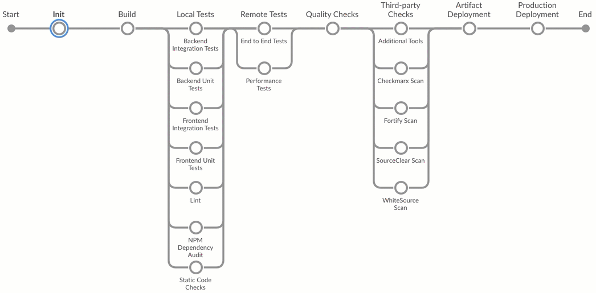

# SAP S/4HANA Cloud SDK Pipeline



## Description

The [SAP S/4HANA Cloud SDK](https://sap.com/s4sdk) helps to develop S/4HANA extension application on the SAP Cloud Platform. 
Continuous integration and delivery (CI/CD) is an important aspect of cloud application development.
This repository contains a Jenkins pipeline as code designed for the requirements and structure of application written with this SDK. 
It contains the steps for building, testing and deploying applications to the SAP Cloud Platform.

## Requirements

### Hardware requirements

At least four gigabyte memory (available to Docker) and at least four gigabyte of disk space on the Jenkins master for downloading Docker images and the persistent storage of Jenkins.

The pipeline will refuse to run with less than one gigabyte available disk space to prevent a situation where the disk is running full.

### Software requirements

For instantiating the SAP S/4HANA Cloud SDK Cx Server, you need to provide a suitable host with a Linux operating system and Docker installed.
Please also ensure that the user with whom you start the Cx Server belongs to the `docker` group.

Please refer to the [operations guide](https://github.com/SAP/cloud-s4-sdk-pipeline/blob/master/doc/operations/operations-guide.md#system-requirement) for more details on hardware and software requirements.

Your project source files need to be available on a git or GitHub server, which is accessible from the Cx Server host.

## Download and Installation

The lifecycle of the Cx Server is maintained by a script called `cx-server`.
It can be found in the `cx-server` folder on the root of each SAP S/4HANA Cloud SDK project archetype.
Together with the `server.cfg` file, this is all you need for starting your instance of the SAP S/4HANA Cloud SDK Cx Server.

You might chose between the available archetypes, depending on the technology you prefer:

- `scp-cf-spring`
- `scp-cf-tomcat`
- `scp-cf-tomee`
- `scp-neo-javaee7`

To create a new project using the SDK execute the following command:

```shell
mvn archetype:generate -DarchetypeGroupId=com.sap.cloud.s4hana.archetypes -DarchetypeArtifactId=scp-cf-tomee -DarchetypeVersion=RELEASE
```

To use one of the other archetypes, replace the value of `DarchetypeArtifactId` accordingly.

In the new project, there is a folder called `cx-server`.
This folder needs to be copied to the future host on which the Cx Server is intended to run.

On the host machine, navigate to the `cx-server` directory and ensure that the `cx-server` file is executable.
After that you can start the Jenkins server with following command:

```shell
./cx-server start
```

In Jenkins, click on "New Item" and create a new "Multi-branch Pipeline" for your repository.  

### Versioning

The default `Jenkinsfile` consumes the `master` branch of the pipeline.
The `master` branch is continuously updated to the latest and greatest version of the pipeline.
However, those updates might in rare cases break your Jenkins build.

For productive usage, it is recommended to use a released version and update as new versions are released.
To do so, change the `pipelineVersion` to the respective git tag (for example `v15`).
Released versions, including release notes are listed on the [GitHub releases page](https://github.com/SAP/cloud-s4-sdk-pipeline/releases).

To stay updated with new pipeline releases, it is recommended to watch the releases of the [cloud-s4-sdk-pipeline](https://github.com/SAP/cloud-s4-sdk-pipeline) repository.
Please refer to [GitHub documentation](https://help.github.com/articles/watching-and-unwatching-releases-for-a-repository/) for details on how to watch releases.
By doing so, you will be notified on GitHub when a new version of the pipeline is released, and can update accordingly.

It is recommended to always update to the latest version, for example by creating a pull request for the Jenkinsfile in your project.
By doing so, you will notice potential upgrade issues in the pull request.

## Blog Posts
In order to learn more about the SAP S/4HANA Cloud SDK Continuous Delivery pipeline, feel free to read our [blog post](https://blogs.sap.com/2017/09/20/continuous-integration-and-delivery).

## Analytics
To improve SAP S/4HANA Cloud SDK Pipeline, we do collect non-personal telemetry data.

For details about which data is collected, and for information on how to opt-out, consult the [analytics documentation](doc/operations/analytics.md).


## Known Issues
Known issues are collected in the [GitHub issues](https://github.com/sap/cloud-s4-sdk-pipeline/issues).
If you encounter an issue, please report it there.
Be sure to remove any confidential information before.

## How to obtain support
If you need any support, have any question or have found a bug, please report it as an issue in the repository.

## License
Copyright (c) 2017-2019 SAP SE or an SAP affiliate company. All rights reserved.
This file is licensed under the Apache Software License, v. 2 except as noted otherwise in the [LICENSE file](LICENSE).
